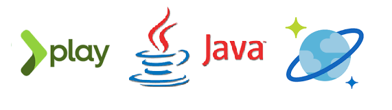

# Overview
A Sample application built with Play framework, integrated with CosmosDB SQL API and a Rest service to demonstrate an end to end non-blocking application. The code base consists of two  projects a REST API called PlayJavaRecommendationService and a Web App which depends on the REST API called PlayJavaReadingListWebApp.

Specifically, the following capabilities are demonstrated:
* Play 2.6 - Routing, Twirl templates, forms, Dependency Injection etc
* Akka HTTP server backend
* Calling REST APIs with Play WS
* Azure CosmosDB SQL API
* CosmosDB Async Java SDK
* RXJava Observable to CompletableFuture

# Getting started

## First:
 * Java 8
 * sbt
 * Create a Cosmos DB collection for SQL API

## Then:
* Update the following properties in application.cong for PlayJavaReadingListWebApp with your Cosmos DB connection information
  - endPoint
  - key
  - dataBase
  - collection
* sbt "run 9001" - from PlayJavaRecommendationService the to start the REST API 
* sbt run - from PlayJavaReadingListWebApp to start the Web Application
* Access the WebApp at http://localhost:9000/

# Highlights

